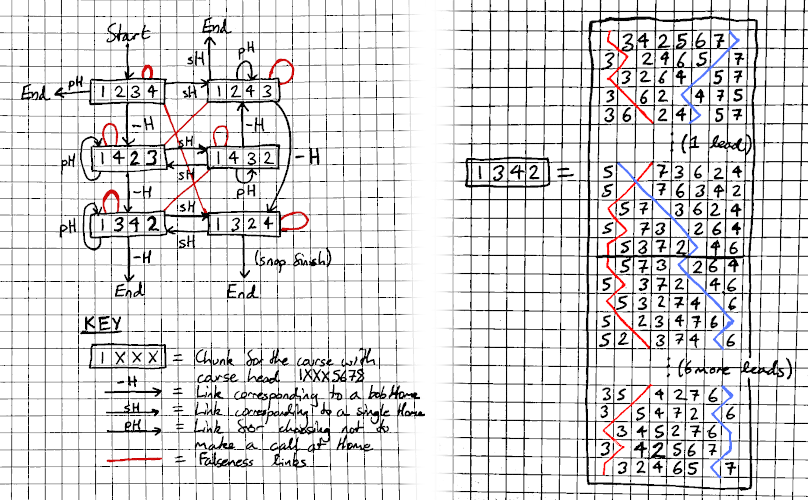
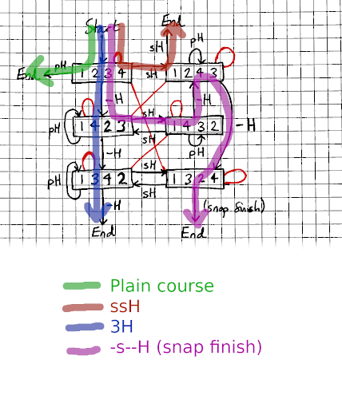

# Architecture of Monument's Code

This document provides a mental map of Monument's code.  It aims to provide four things for
newcomers to the code:

1. [\[link\]](#overview-of-monument) An overview of Monument.
2. [\[link\]](#data-flow) A description of how data flows through the code during a single
   composition search.
3. [\[link\]](#code-map) An answer to the question: _'What does X code do?'_

---

## Overview of Monument

As stated in the README file, Monument is a composition _generator_.  I.e. it can be thought of as
a computer composer: you provide it with a description of what compositions you want and it
generates the best compositions it can, according to your definition of 'good'.

The ultimate goal of Monument is to **get you compositions that you want to ring, as quickly and
easily as possible**.

Note that this doesn't necessarily mean generating the perfect composition, or generating _every
possible_ composition.  Monument guarantees neither of these but in return, Monument is **orders of
magnitude faster** than any other composing program I'm aware of (if anyone knows of any faster
generally-available program, then please let me know!).

## Under the Hood

Under the hood, Monument's architecture is very similar to that of SMC32.  A composition search
consists of three phases.

1. The query is parsed from the input TOML file and validated.

2. [A **composition graph**](#the-composition-graph) is built.  This contains every atomic 'chunk'
   of composition, along with how these can be 'linked' together (with calls, splices, or plain
   leads).  Finally, this also records which chunks are false against each other.  Compositions are
   now represented as _paths_ through the graph.

3. Monument runs [best-first tree search](#best-first-tree-search) over the possible **paths**
   through the composition graph.  This works by progressively extending short compositions (which
   will likely not have come round yet) until eventually an 'end' link is found and the composition
   comes round.  Monument then checks that this new composition satisfies the user's requirements -
   it is the right length, it has the right method balance, reaches a valid part head, etc.).  If
   all the constraints are satisfied, the composition is printed to the user's screen.

### The Composition Graph

The composition graph is how Monument represents the space of possible compositions and, as such,
is the heart of Monument.

Monument's composition graph is very similar to that of SMC32, with the extra complexity of handling
spliced and explicit multiparts.  Generating this graph efficiently and correctly, handling all
ringing's edge cases, is challenging enough that a significant proportion of Monument's code is
solely involved in graph building.  However, once the graph is built, it abstracts away much of the
details of ringing and provides a representation of compositions which is incredibly succinct and
easy to modify and reason about.

#### Diagram of an Example Graph

Suppose we ask Monument for a composition of Yorkshire Major in which the calls are all Homes:

```toml
length = { min = 0, max = 2000 }
method = "Yorkshire Surprise Major"
courses = "*5678" # Force 5678 to be unaffected, restricting us to only Homes
```

This will generate a composition graph like this.  Note that every box is **an entire course**:



Also note how compositions now corresponds to paths through this graph:



#### Components of a Composition Graph

A composition graph is made of three major components:

1. **Chunks.**  A chunk corresponds to a single atomic (i.e. unsplittable) section of ringing.  In
   other words: once we start ringing a chunk, we must ring it to completion before making the next
   decision in the composition.

   For example, in 'normal' spliced, we always have to ring whole leads of any method but a splice
   can occur at every lead, so each chunk in the resulting graph will correspond to a single
   lead.  In other compositions, a single chunk could contain many leads; for example, in
   tenors-together Yorkshire Royal, we cannot make a call during the four leads between Home and
   Middle, so these four leads would form a single chunk.

   Mathematically, these are the _nodes_ in the composition graph.

2. **Links.**  A link denotes that it is possible for one chunk to follow another, and correspond
   to _decisions_ in the composition.  A link could correspond to a call, a method splice
   or a decision to do neither (i.e. a 'plain' link).

   Starting and ending a composition is also represented as links.  These are links where one end
   doesn't correspond to a chunk - instead it points to a magic 'start' or 'end' entity.

   Mathematically, these are _directed edges_ in the composition graph.

3. **Falseness links.**  A falseness link joins two chunks which are mutually false.  Specifically,
   a falseness link from chunk A to chunk B signals that ringing chunk A means that chunk B can no
   longer be rung.
  
   Therefore, all chunks have falseness links to themselves - because ringing a chunk means that it
   can no longer be rung again.  Truly self-fase chunks (ones which contain a repeated row) are
   completely removed from the graph during construction.

   Mathematically, these form an _undirected graph_ over the same nodes as the other graph.

### Best-First Tree Search

To perform tree search, Monument stores a queue of prefixes which it is interested in expanding.
Every iteration of the core composing loop, Monument picks a prefix from the queue and extends
it.  This creates a new prefix for every possible action at that point (e.g. new prefixes could
be created for 'call a bob', 'call a single', 'choose to call nothing').  These new prefixes are
returned to the queue and a new iteration begins.

If the prefix being expanded has the magic 'end' entity as a next step, the prefix has come round
and becomes a full composition.
A `Composition` struct is created for this new composition and is validated against the constraints
of the composition (e.g. is it long enough, does it have a valid method balance, etc.).  If it is
valid, the composition is sent down a channel to the printing thread and printed to the user's
screen.

Exactly how the new prefix is chosen for expansion is the secret sauce which makes Monument so
fast, and is incredibly simple:  Monument will choose to expand the prefix which has **the highest
score per row**.

This is the key to how Monument is so fast - it prioritises exploring the composition ideas
which are most likely to eventually create good compositions.  It doesn't matter if the core
composing loop is hundreds of times slower than SMC's; Monument needs to run that loop many, many
orders of magnitude fewer times before very good compositions are generated.

However, the cost of this is that Monument must store many, many, many prefixes in the queue
in order to have different ideas to explore (the queue will often contain _tens of millions_ of
prefixes).  Not only does this require a huge amount of memory (meaning it is important to minimise
the memory footprint of each prefix) - but this also puts heavy pressure on the memory allocator
(meaning that Monument generally relies on pre-allocating blocks of memory for data which changes
often).

---

## Data Flow

This section describes the data flow through Monument.

Monument's architecture is similar to that of multi-pass compilers: Data is processed by converting
it between increasingly detailed and abstract data types. 

The overall flow of each run of Monument consists of three major steps, each of which is given a
section below:

1. [**Parsing and Validation**](#stage-1-parsing-and-validation)
2. [**Graph Building**](#stage-2-graph-building)
3. [**Composition Search**](#stage-3-composition-search)

This section finishes with a diagram showing the [**Overall Data Flow**](#overall-data-flow).

### Stage 1: Parsing and Validation

The first step for Monument is to read and validate the information stored in the TOML file.  This
begins with a TOML file on disk, and finishes with an instance of `monument::query::Query` (which
contains the same data, but in a strongly typed and validated form).

This currently requires multiple steps, as shown below.  The structures of of these data types
(`monument_cli::toml_file::TomlFile`, `monument::SearchBuilder` and `monument::query::Query`)
is largely recognisable as the same format as the TOML file.  However, each step performs
additional validation and, where needed, converts the data into Monument's internal data types.

```text
            +-----------+
            | TOML File |         (on disk)
            +-----------+
                  |
                  |
               parsing       (handled by the `serde` and `toml` libraries)
                  |
                  V
        +-------------------+
        | `TomlFile` struct |     (found in `cli/src/toml_file.rs`)
        +-------------------+
                  |
                  |
             validation      (handled by `TomlFile::to_search`)
                  |
                  V
      +------------------------+
      | `SearchBuilder` struct |  (found in `lib/src/builder/mod.rs`)
      +------------------------+
                  |
                  |
          more validation    (handled by `SearchBuilder::build`)
                  |
                  V
         +----------------+
         | `Query` struct |       (found in `lib/src/query.rs`)
         +----------------+
```

### Stage 2: Graph Building

As described in section on [The Composition Graph](#the-composition-graph), much of the code of
Monument is involved with building an abstract graph of all possible pieces of the composition and
how they are linked together.

There are actually two graph types in Monument:

1. `monument::graph::Graph` in **lib/src/graph/mod.rs**, which is the first graph to be built.
   This graph stores the chunks in a `HashMap` and is easy and efficient to modify, but
   accessing each chunk is relatively slow (involving a `HashMap` lookup).
2. `monument::search::Graph` in **lib/src/search/graph.rs**, which is copied from a
   `monument::graph::Graph` while setting up for the search.  This stores the nodes in a flat array
   (i.e. a `Vec`tor) and is very fast to access but is almost impossible to modify.

The overall graph building flow is as follows:

```text
         +----------------+
         | `Query` struct |              (found in `lib/src/query.rs`)
         +----------------+
                  |
                  |
          layout generation      (found mainly in `lib/src/graph/build/layout.rs`)
                  |
                  V
 +-----------------------------------+
 | `HashMap<ChunkId, PerPartLength>` |   (which chunks are possible, and how long they are)
 +-----------------------------------+
                  |
                  |
         atw table generation   (found in `lib/src/atw.rs`)
                  |
        falseness calculation   (found in `lib/src/graph/build/falseness.rs`)
                  |
            music counting
                  |
                  V
  +---------------------------------+
  | `monument::graph::Graph` struct |     (found in `lib/src/graph/mod.rs`)
  +---------------------------------+
                  |
             optimization
                  |
                  V
  +---------------------------------+
  | `monument::graph::Graph` struct |
  +---------------------------------+
                  |
                  |
              copy data
                  |
                  V
  +----------------------------------+
  | `monument::search::Graph` struct |     (fast access graph, found in `lib/src/search/graph.rs`)
  +----------------------------------+
```


### Stage 3: Composition Search

Once the fast access, optimized graph is created, Monument can begin performing tree search over
compositions, which are represented as increasingly long paths through the composition graph.
These are referred to as composition `Prefix`es, since they correspond to the first part of
complete composition.  A completed composition is stored as a `Composition` struct.

All of this code is found in the `lib/src/search` directory.

The overall flow of the search algorithm is as follows:

```text
  +----------------------------------+
  | `monument::search::Graph` struct |
  +----------------------------------+
                  |
                  |
                  V
         +-----------------+
         | `Prefix` struct |           (found in `lib/src/search/prefix.rs`)
         +-----------------+
                  |
                  |
          repeated expansion     (found in `lib/src/search/best_first.rs`)
                  |
                  V
         +-----------------+
         | `Prefix` struct |
         +-----------------+
                  |
                  |
       composition comes round
                  |
              validation          (found in the `Prefix::expand` function)
                  |
                  V
       +----------------------+
       | `Composition` struct |   (found in `lib/src/composition.rs`)
       +----------------------+
                  |
                  |
          sent down channel
                  |
           pretty printing        (found in `cli/src/logging.rs`)
                  |
                  V
      +------------------------+
      | User's screen (stdout) |
      +------------------------+
```

----

## Code Map

### Command-Line Interface

```text
cli/src
├── lib.rs            (crate root)
├── main.rs           (entry point of Monument)
├── args.rs           (parsing of CLI arguments)
│
├── toml_file.rs      |
├── calls.rs          | Specification of the CLI interface
├── music.rs          |
│
├── logging.rs        (pretty printing of compositions)
│
├── default-music-major.toml    |
├── default-music-maximus.toml  |
├── default-music-minor.toml    | Default music files
├── default-music-royal.toml    |
├── default-music-triples.toml  |
│
└── utils.rs          (misc utilities)
```

### Core (non-CLI-specific) Library

```text
lib/src
├── lib.rs               (crate root)
│
├── builder              ('builder' API for constructing search queries)
│  ├── mod.rs
│  └── methods.rs
├── query.rs             (fully validated description of a search query)
├── composition.rs       (a generated composition)
│
├── graph
│  ├── mod.rs            (definition of the easy-to-modify graph)
│  │
│  ├── build
│  │  ├── falseness.rs   |
│  │  ├── layout.rs      | Graph building
│  │  └── mod.rs         |
│  │
│  └── optimise
│     ├── mod.rs         |
│     ├── music.rs       | Graph optimization (removing unneeded sections of the graph)
│     └── strip_refs.rs  |
│
├── search               (search routine)
│  ├── mod.rs
│  ├── best_first.rs     (code for best-first search)
│  ├── graph.rs          (quick-access graph)
│  ├── prefix.rs         (composition prefixes, including expansion thereof)
│  └── path.rs           (efficient storage of paths through the composition graph)
│
├── error.rs             (errors returned by Monument)
├── atw.rs               (efficient calcuation of atw)
├── group.rs             (part head group)
├── prove_length.rs      (proves which lengths and method counts are possible)
│
└── utils
   ├── counts.rs         |
   ├── lengths.rs        | Misc utilities
   └── mod.rs            |
```
